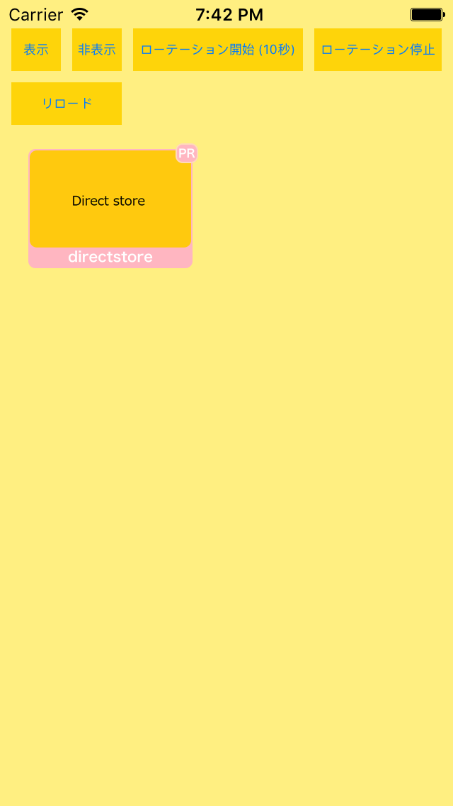

<div align="center">

</div>

# AMoAd Native Demo for iOS




## Introduction

ネイティブ広告のスタイルを管理画面よりHTML+CSSでデザインできます。

## Requirements

iOS 6.0 or later

## Installing

[ZIPをダウンロード](https://github.com/amoad/amoad-native-ios-sdk/archive/master.zip) *Cocoa Podsに対応予定*

## Usage

管理画面から取得したsidをViewController.mのkSidに設定する。tagは複数の広告を区別するための任意文字列です。

```objectivec
// [SDK] 管理画面から取得したsidを入力してください
static NSString *const kSid = @"62056d310111552c000000000000000000000000000000000000000000000000";
static NSString *const kTag = @"Ad01";
```

## API

[AMoAd Native API](AMoAdNativeDemo/AMoAdNativeDemo/AMoAdSdk/AMoAdNative.h)

[AMoAd Logger API](AMoAdNativeDemo/AMoAdNativeDemo/AMoAdSdk/AMoAdLogger.h)
